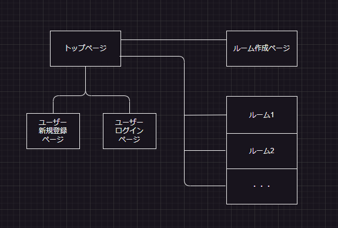
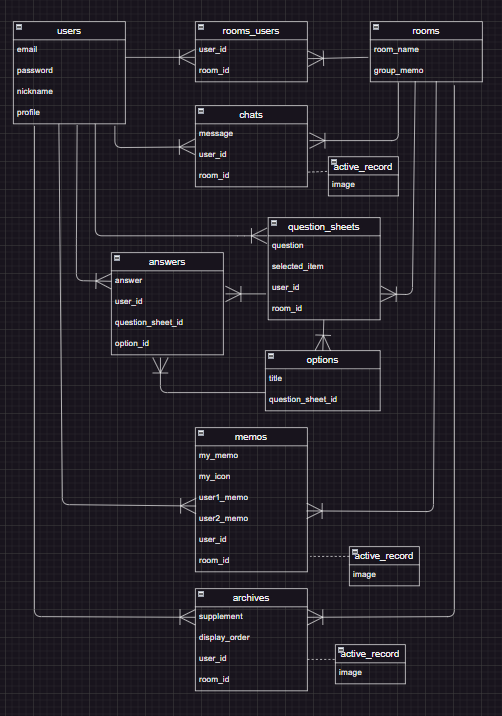

# README

 

## 画面遷移図

 

## ER図

  

# テーブル設計

## users テーブル

| Column             | Type   | Options     |
| ------------------ | ------ | ----------- |
| email              | string | null: false, unique: true |
| encrypted_password | string | null: false |
| nickname           | string | null: false |
| profile            | string | null: false |

### Association

- has_many :rooms_users
- has_many :rooms, through: :rooms_users
- has_many :chats
- has_many :question_sheets_users
- has_many :question_sheets, through: :question_sheets_users
- has_many :memos
- has_many :archives

## rooms テーブル

| Column            | Type    | Options     |
| ----------------- | ------- | ----------- |
| room_name         | string  | null: false |
| group_memo        | text    | null: false |

### Association

- has_many :rooms_users
- has_many :users, through: :rooms_users
- has_many :chats
- has_many :question_sheets
- has_many :memos
- has_many :archives

## rooms_users テーブル

| Column            | Type    | Options     |
| ----------------- | ------- | ----------- |
| user_id           | references | null: false, foreign_key: true |
| room_id           | references | null: false, foreign_key: true |

### Association

- belongs_to :user
- belongs_to :room

## chats テーブル

| Column            | Type       | Options     |
| ----------------- | ---------- | ----------- |
| message           | text       | null: false |
| user_id           | references | null: false, foreign_key: true |
| room_id           | references | null: false, foreign_key: true |

### Association

- belongs_to :user
- belongs_to :room
- has_one_attached :image

## question_sheets テーブル

| Column            | Type       | Options     |
| ----------------- | ---------- | ----------- |
| message           | string     
| answer1           | string
| answer2           | string
| answer3           | string
| room_id           | references | null: false, foreign_key: true |

### Association

- has_many :question_sheets_users
- has_many :users, through: :question_sheets_users
- belongs_to :room

## question_sheets_users テーブル

| Column            | Type       | Options     |
| ----------------- | ---------- | ----------- |
| room_id           | references | null: false, foreign_key: true |
| question_sheets_users_id       | references | null: false, foreign_key: true |

### Association

- belongs_to :user
- belongs_to :question_sheet

## memos テーブル

| Column            | Type       | Options     |
| ----------------- | ---------- | ----------- |
| my_memo           | text       
| user1_memo        | text       
| user2_memo        | text       
| user_id           | references | null: false, foreign_key: true |
| room_id           | references | null: false, foreign_key: true |

### Association

- belongs_to :user
- belongs_to :room

## archives テーブル

| Column            | Type       | Options     |
| ----------------- | ---------- | ----------- |
| supplement        | string       
| display_order     | text       | null: false |
| user_id           | references | null: false, foreign_key: true |
| room_id           | references | null: false, foreign_key: true |

### Association

- belongs_to :user
- belongs_to :room
- has_one_attached :image